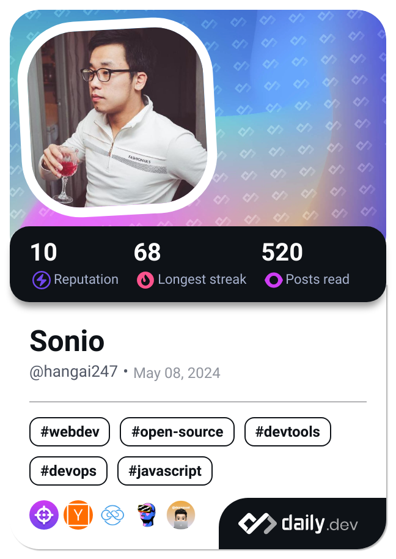

# Hey there! 👋 I'm Sonio!

I'm a **Senior Software Engineer** at **Asurion** and a **Tech Lead** at [**Gertech Inc**](https://www.gertech.jp/) 💊 and [**Aplus**](https://aplus.mn/) 🎓. I enjoy solving problems, learning new things, and building useful software with great teams.

---

## My Tech Stack 🛠️

- **Languages:**
  🦀 Rust • 🟢 Node.js • 🔵 TypeScript

- **Frontend:**
  ⚛️ React • 📱 React Native • ⚡ Next.js

- **Cloud & DevOps:**
  ☁️ AWS • 🚢 Kubernetes

---

## What I’m Working On 🚀

- **Asurion:** Exploring tech and contributing to interesting projects.
- **Gertech Inc:** Supporting healthcare with digital tools.
- **Aplus EdTech:** Creating tools that help students learn more effectively.

---

## A Few Things About Me 🌱

- I appreciate clean code and simple solutions.
- I’m always curious and enjoy learning from others.
- When I’m not coding, I am reading code.

---

## Let’s Connect! 🌐

- [LinkedIn](https://www.linkedin.com/in/hangai247/)
  (Feel free to reach out!)

##

